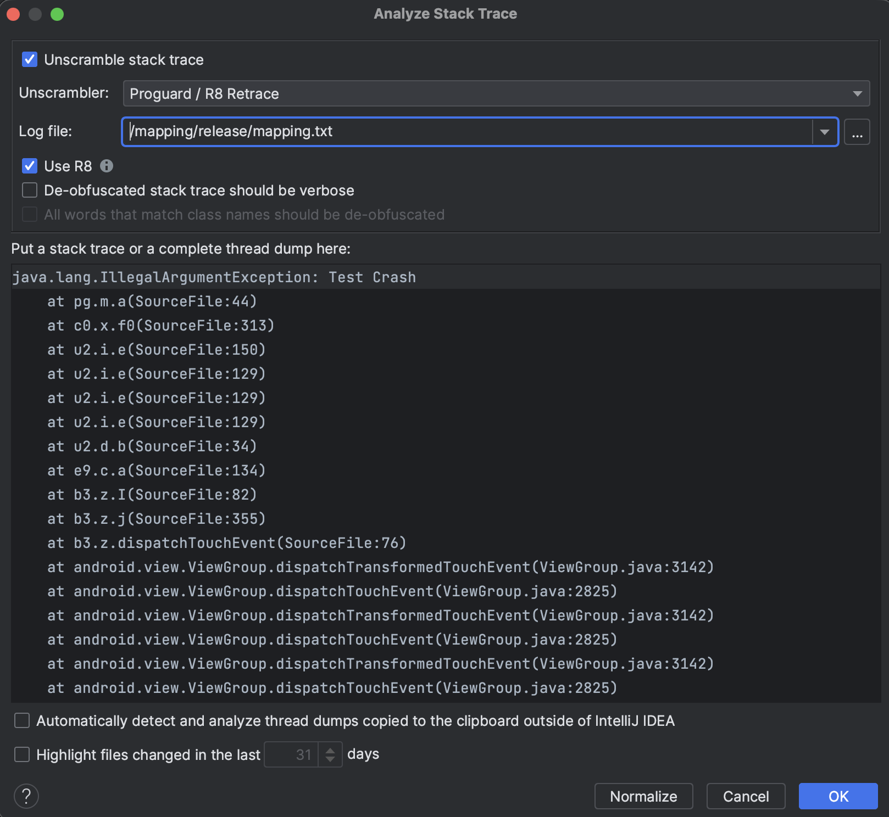

# Proguard Retrace Unscrambler [](https://github.com/chrimaeon/proguard-retrace-unscrambler/actions/workflows/main.yml)

[](http://www.apache.org/licenses/LICENSE-2.0)
[][3]

<picture>
  <source media="(prefers-color-scheme: dark)" srcset="./art/pluginIcon-dark.svg">
  <source media="(prefers-color-scheme: light)" srcset="./art/pluginIcon.svg">
  
</picture>

This is an [IntelliJ IDEA][1] and [Android Studio][2] Plugin to de-obfuscate your stacktraces.

## Installation

* In the Settings/Preferences dialog, select Plugins.
* Search for `Proguard / R8 Retrace Unscrambler`

OR

Download it from the Plugin Marketplace: [Proguard Retrace Unscrambler][3]

## Usage

In IntelliJ IDEA or Android Studio

* Go to _Analyze_
* Select _Analyze Stacktrace…_
* Check _Unscramble stacktrace_
* Select _Proguard / R8 Retrace_
* Choose Proguard/R8 mapping file in _Log file_
* Paste stacktrace and Press _OK_



## License

```text
Copyright (c) 2020. Christian Grach <christian.grach@cmgapps.com>

SPDX-Licence-Identifier: Apache-2.0
```

[1]: https://www.jetbrains.com/idea/
[2]: https://developer.android.com/studio/index.html
[3]: https://plugins.jetbrains.com/plugin/15267-proguard-retrace-unscrambler
